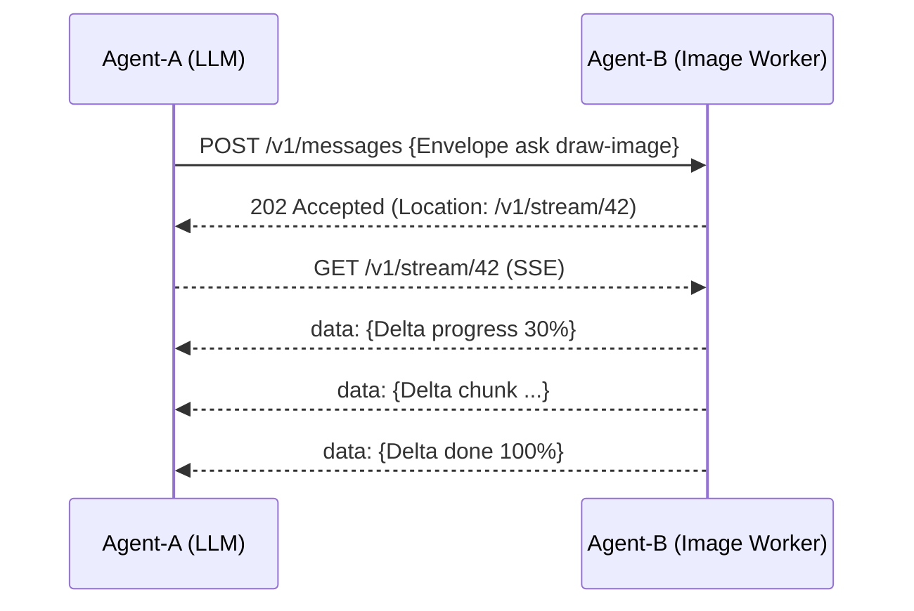

# ✨ Universal Agent Messaging Protocol (UAMP)🌐

> **Open, secure and streaming‑native messaging for AI agents, services, and robots.**
> **Current spec:** v1.0  •  **Reference runtime:** Python / Node  •  **License:** Apache‑2.0 (code), CC‑BY‑4.0 (spec)

[](https://github.com/koha-tech/uamp/actions)
[](https://www.npmjs.com/package/uamp-js)
[](LICENSE)

---

## TL;DR

**UAMP** is to AI agents what HTTP is to web services: a minimal, transport‑agnostic envelope with built‑in streaming, cryptographic integrity, and zero‑trust security.
It glues together LLM chains, robotic fleets, IoT sensors, and legacy multi‑agent systems – all over familiar transports (HTTP/2, HTTP/3, gRPC, WebSocket).



---

## Key Features

* **📦 Envelope Freeze** – stable wire format from v1.0 onward.
* **🔐 Built‑in Security** – detached JWS signatures, mTLS/OAuth2, capability JWT.
* **🚀 Streaming‑first** – granular `Delta` patches, back‑pressure, low latency.
* **🌍 Transport Choice** – HTTP/2 + SSE, HTTP/3 (QUIC), WebSocket, **gRPC**.
* **📚 Polyglot SDKs** – Python reference stack, TypeScript/Node SDK (`uamp-js`), more coming (Go, Rust).

---

## Get the JS SDK

```bash
npm install uamp-js
```

```ts
import { UAMPClient, genKey } from 'uamp-js'
const { privateKey } = await genKey()
const client = new UAMPClient('https://localhost:8443', privateKey)
await client.send('Ping from JS', 'did:web:worker.example')
```

---

## Documentation

* **Spec v1.0** → [`/docs/uamp-1.0.md`](spec/uamp-1.0.md)
* **Design principles** → [`/docs/design-principles.md`](docs/design-principles.md)
* **Roadmap 1.x → 2.0** → [`/docs/roadmap.md`](docs/roadmap.md)

---

## Contributing

We welcome PRs and issues!  Please read [`CONTRIBUTING.md`](CONTRIBUTING.md) and check the open [good‑first‑issue](https://github.com/uamp-project/uamp/labels/good%20first%20issue) list.

---

© 2025 UAMP Project – Spec under **CC BY 4.0**, code under **Apache‑2.0**.
