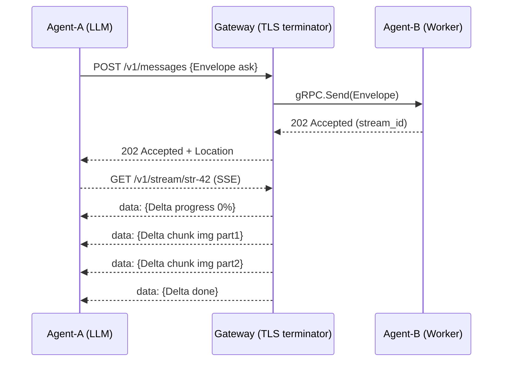
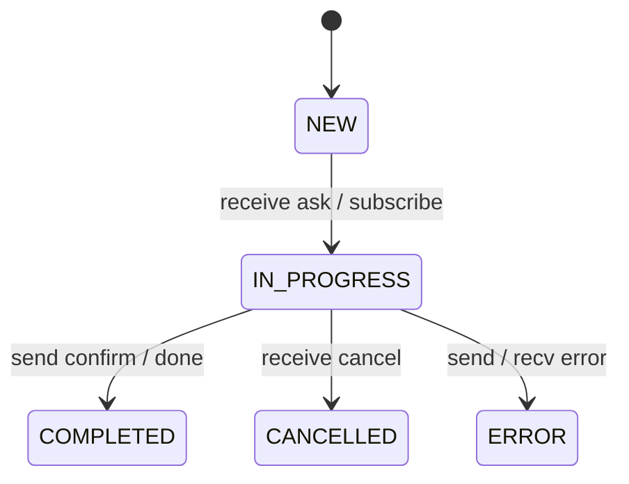
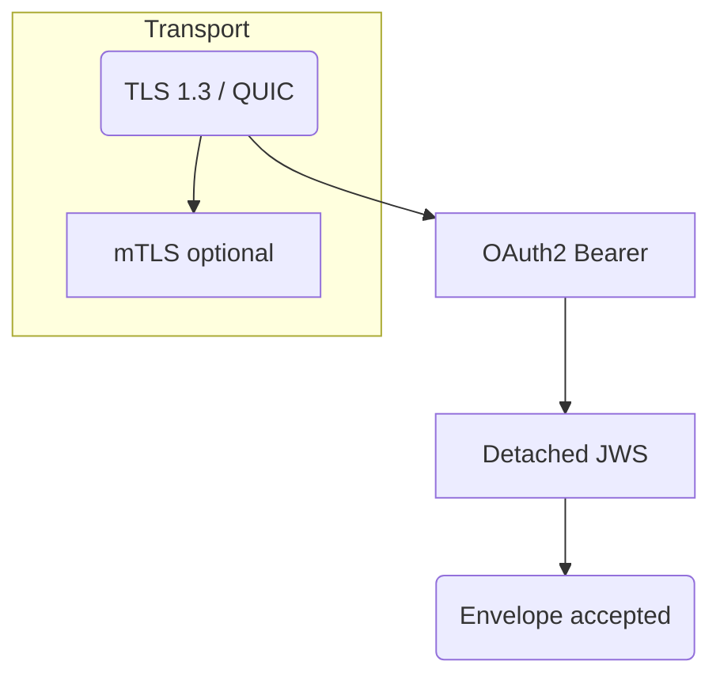

# Universal Agent Messaging Protocol (UAMP) — **Version 1.0**

*Published 10 July 2025 – Stable / Long-Term Support 1.x*

---

## 0  Abstract
UAMP 1.0 freezes a small, intent-oriented JSON envelope that flows intact over HTTP/2, HTTP/3 (QUIC), WebSocket or gRPC. Every envelope is cryptographically signed (detached JWS) and can be streamed via ordered *delta* patches with back-pressure. This document is the normative reference for all 1.x implementations.

---

## 1  Envelope (wire format – frozen)
```jsonc
{
  "id": "urn:uuid:…",                // UUIDv4, unique
  "ts": "2025-07-10T13:37:05Z",      // ISO-8601 UTC
  "from": "did:web:client.example",   // Sender DID/URI
  "to": ["did:web:worker.example"],   // One or many receivers
  "intent": "ask",                    // Canonical vocabulary (§1.1)
  "reply_to": "urn:uuid:…?",          // Optional correlation ID
  "context": [{                        // Chain-of-thought refs
    "id": "urn:uuid:prev",            // previous envelope
    "hash": "sha256:…"                // integrity proof
  }],
  "stream_id": "str-42?",             // Optional streaming channel
  "delta_window": 64,                  // Flow-control window
  "body": {
    "type": "text/markdown",
    "content": "# Draw me a sheep…",
    "encoding": "utf-8",
    "compression": "none"
  },
  "cap_token": "eyJ…",                // JWT/CWT capability
  "sig": "mG0Y…",                    // Detached JWS over canonical JSON
  "ext": { "x-trace": "b3:…" }        // Free extension slot
}
```
### 1.1  Canonical intent vocabulary
| Intent | Purpose |
|--------|---------|
| `ask` | Request action / answer (synchronous) |
| `inform` | Provide data without expecting reply |
| `propose` | Offer a plan or contract |
| `confirm` / `deny` | Positive / negative ACK |
| `progress` | Partial result, keep-alive |
| `cancel` | Withdraw a pending request |
| `subscribe` / `notify` | Long-lived event stream |
| `error` | Failure report |

---

## 2  Delta (stream patch)
```jsonc
{
  "delta_seq": 17,           // Monotonic sequence
  "stream_id": "str-42",
  "ts": "2025-07-10T13:38:01Z",
  "type": "chunk",          // patch | chunk | progress | done | cancel | error
  "payload": { … }          // Content depends on type
}
```
Consumers **ACK** via `progress` every `delta_window` frames. Producers **MUST NOT** exceed the un-ACKed window.

---

## 3  Mermaid — End-to-End flow (HTTP/3 + SSE)


---

## 4  State machine (normative)


---

## 5  Security model

* Transport: **TLS 1.3** or **QUIC 1** required.
* Authentication: mTLS **or** OAuth 2.1 access token.
* Authorisation: capability JWT in `cap_token`.
* Integrity: detached JWS (`sig`).

---

## 6  Transport bindings (normative)
| Binding | Endpoint(s) | Notes |
|---------|-------------|-------|
| HTTP/2 + SSE | `POST /v1/messages`, `GET /v1/stream/:id` | default |
| HTTP/3 (QUIC) | same paths, ALPN `h3` | stream-ID ↔ `stream_id` |
| WebSocket | `wss://host/uamp/1/ws` | length-prefixed JSON frames |
| gRPC | service `uamp.v1.Agent` (`uamp.proto`) | duplex stream, proto schema in /protos |

---

## 7  Discovery
* **Manifest** `/.well-known/agent-manifest.json` — MUST be JWS-signed.
* **Federation hub** `/.well-known/agent-hub.json` lists child manifests + JWK-set.
* Trust-anchors: DID Doc or X.509 CA.

---

## 8  Error codes
| Code | Meaning | Retry |
|------|---------|-------|
| `4.01` | unauthenticated | no |
| `4.03` | unauthorized | no |
| `4.09` | missing `delta_seq` | yes |
| `4.13` | payload too large | no |
| `5.04` | backend busy | yes (Retry-After) |

---

## 9  Change log
* **1.0** — envelope freeze, QUIC + gRPC normative, signed manifest mandatory.
* 0.2-draft — audit fixes, extended intents, flow-control.
* 0.1-draft — initial public draft.

---

© 2025 UAMP Project — Spec licensed **CC BY 4.0**.
