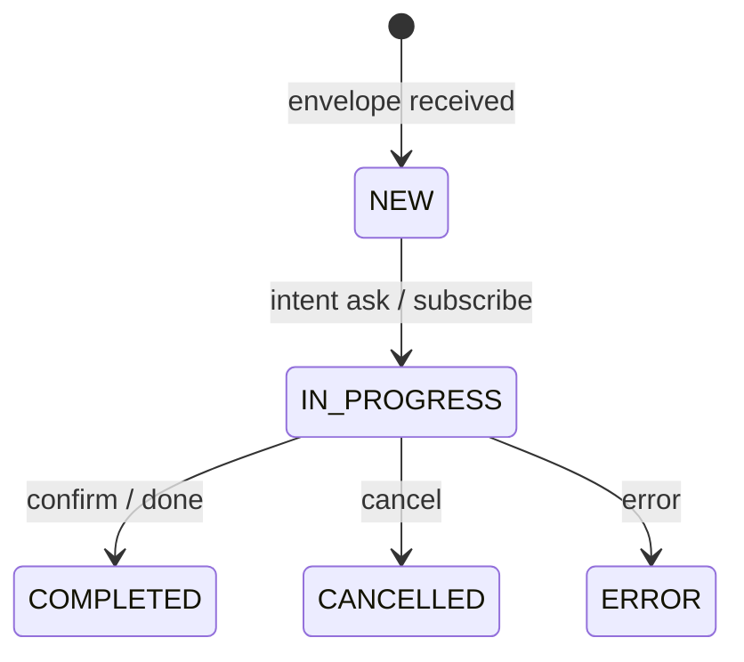

# Universal Agent Messaging Protocol (UAMP) — **SPECIFICATION 1.0**

<small>© 2025 UAMP Project — Spec licensed CC BY 4.0</small>

---

## Table of Contents
1. [Introduction](#1-introduction)
2. [Normative References](#2-normative-references)
3. [Terminology](#3-terminology)
4. [Envelope](#4-envelope)  
   4.1 Canonical Intent Vocabulary  
   4.2 Canonical JSON Normalisation
5. [Delta Streaming](#5-delta-streaming)
6. [Security Model](#6-security-model)
7. [Transport Bindings](#7-transport-bindings)
8. [Discovery & Federation](#8-discovery--federation)
9. [Error Codes](#9-error-codes)
10. [State Machines](#10-state-machines)
11. [IANA Considerations](#11-iana-considerations)
12. [Change Log](#12-change-log)
13. [Appendices](#13-appendices)

---

## 1  Introduction <a id="1-introduction"></a>
UAMP defines a minimal, transport‑agnostic message envelope that allows heterogeneous AI agents, robotic controllers and legacy MAS components to exchange signed requests, responses and streaming deltas through standard web protocols (HTTP/2, HTTP/3, WebSocket, gRPC). Version 1.0 freezes the wire format for long‑term interoperability.

## 2  Normative References <a id="2-normative-references"></a>
* **RFC 2119** – Key words for use in RFCs to indicate requirement levels.
* **RFC 7515** – JSON Web Signature (JWS).
* **RFC 8446** – TLS 1.3.
* **I-D.quic-http** – HTTP over QUIC.
* **JSON Schema 2020‑12**.

## 3  Terminology <a id="3-terminology"></a>
**Agent** – logical entity that can send and/or receive UAMP envelopes.  
**Envelope** – JSON object defined in §4.  
**Delta** – streaming patch frame defined in §5.  
**Binding** – mapping of envelope to a concrete transport.  
The capitalised keywords **MUST**, **SHOULD**, **MAY** follow RFC 2119.

## 4  Envelope (wire format – frozen) <a id="4-envelope"></a>
```jsonc
{
  "id"           : "urn:uuid:...",              // UUID v4
  "ts"           : "2025-07-10T13:37:05Z",      // ISO‑8601 UTC
  "from"         : "did:web:client.example",
  "to"           : ["did:web:worker.example"],
  "intent"       : "ask",                        // §4.1
  "reply_to"     : "urn:uuid:...?",              // optional
  "context"      : [{"id":"…","hash":"sha256:…"}],
  "stream_id"    : "str-42?",
  "delta_window" : 64,                            // default
  "body"         : {
    "type"       : "text/markdown",
    "content"    : "# Draw me a sheep…",
    "encoding"   : "utf-8",
    "compression": "none"
  },
  "cap_token"    : "eyJ…",                        // JWT / CWT
  "sig"          : "mG0Y…",                      // detached JWS (§6.2)
  "ext"          : { "x-trace": "b3:…" }
}
```
### 4.1  Canonical Intent Vocabulary
| Intent | Semantics |
|--------|-----------|
| `ask` | Request action / answer and expect direct response |
| `inform` | Provide data without expecting response |
| `propose` | Offer contract / plan |
| `confirm` / `deny` | ACK / NAK |
| `progress` | Partial update within a stream |
| `cancel` | Withdraw a pending request |
| `subscribe` / `notify` | Establish or push event on long‑lived stream |
| `error` | Failure report |

### 4.2  Canonical JSON Normalisation
To compute the `sha256` value used in the JWS payload the envelope is serialised as follows:
1. Keys sorted lexicographically, UTF‑8, no extra whitespace.
2. The `sig` property **MUST** be excluded from the hash.

## 5  Delta Streaming <a id="5-delta-streaming"></a>
```jsonc
{
  "delta_seq" : 17,
  "stream_id" : "str-42",
  "ts"        : "2025-07-10T13:38:01Z",
  "type"      : "chunk",        // patch | chunk | done | cancel | error | progress
  "payload"   : { ... }
}
```
* Producer **MUST NOT** send more than `delta_window` un‑ACKed frames.
* Consumer **SHOULD** ACK via `progress` every N frames where N ≤ `delta_window`.

## 6  Security Model <a id="6-security-model"></a>
### 6.1  Transport Security
Transport **MUST** be TLS 1.3 (ALPN `h2` or `h3`) or QUIC 1. Unencrypted connections are disallowed.

### 6.2  Authentication & Authorisation
* mTLS with client cert **OR** OAuth 2.1 Bearer token.
* Capability token (`cap_token`) **SHOULD** be JWT/CWT with `aud`, `scope`, `exp` claims.

### 6.3  Integrity
Every envelope **MUST** carry `sig` – detached JWS using `ES256` or `EdDSA`. The JWS payload **MUST** be `{ "sha256": "…" }`.

## 7  Transport Bindings <a id="7-transport-bindings"></a>
| Binding | Endpoint(s) | Notes |
|---------|-------------|-------|
| HTTP/2 + SSE | `POST /v1/messages`, `GET /v1/stream/{id}` | body = envelope JSON, SSE lines = deltas |
| HTTP/3 (QUIC) | Same paths, ALPN `h3` | QUIC stream‑ID == `stream_id` |
| WebSocket | `wss://host/uamp/1/ws` | Frames: 4‑byte length prefix + envelope/delta JSON |
| gRPC | `service uamp.v1.Agent` | see `protos/uamp.proto` |

## 8  Discovery & Federation <a id="8-discovery--federation"></a>
* **Manifest** (`/.well-known/agent-manifest.json`) – signed JWS, media‑type `application/manifest+jws`.
* **Hub** (`/.well-known/agent-hub.json`) lists child manifests and trust anchors.

## 9  Error Codes <a id="9-error-codes"></a>
| Code | Condition | Retry ? |
|------|-----------|---------|
| 4.01 | Unauthenticated | ✗ |
| 4.03 | Unauthorized | ✗ |
| 4.09 | Missing `delta_seq` | ✓ |
| 4.13 | Payload too large | ✗ |
| 5.04 | Backend busy | ✓ (Retry‑After) |

## 10  State Machines <a id="10-state-machines"></a>


## 11  IANA Considerations <a id="11-iana-considerations"></a>
The following media types are requested:
* `application/uamp+json` – Envelope (this document).
* `application/manifest+jws` – Signed Manifest.

## 12  Change Log <a id="12-change-log"></a>
* **1.0** – initial public draft.


## 13  Appendices <a id="13-appendices"></a>
* **A** JSON Schemas (envelope, delta, manifest).
* **B** Design Rationale (see `/docs/design-principles.md`).
* **C** Examples (minimal request/response, streaming image generation).

---

### Appendix A — JSON Schemas
<sub>Draft 2020‑12; `$schema` omitted for brevity.</sub>

#### A.1 Envelope
```jsonc
{
  "$id": "https://uamp.dev/schemas/envelope-1.0.json",
  "type": "object",
  "required": ["id", "ts", "from", "to", "intent", "body", "sig"],
  "additionalProperties": false,
  "properties": {
    "id": { "type": "string", "format": "uuid" },
    "ts": { "type": "string", "format": "date-time" },
    "from": { "type": "string", "format": "uri" },
    "to":   { "type": "array", "items": {"type": "string", "format": "uri"}, "minItems": 1 },
    "intent": { "enum": ["ask","inform","propose","confirm","deny","progress","cancel","subscribe","notify","error"] },
    "reply_to": { "type": "string", "format": "uuid" },
    "context": {
      "type": "array",
      "items": {
        "type": "object",
        "required": ["id","hash"],
        "properties": {
          "id": {"type": "string", "format": "uuid"},
          "hash": {"type": "string", "pattern": "^sha256:[0-9a-f]{64}$"}
        }
      }
    },
    "stream_id": { "type": "string" },
    "delta_window": { "type": "integer", "minimum": 1, "default": 64 },
    "body": {
      "type": "object",
      "required": ["type","content"],
      "properties": {
        "type": { "type": "string" },
        "content": { "type": "string" },
        "encoding": { "type": "string", "default": "utf-8" },
        "compression": { "type": "string", "default": "none" }
      }
    },
    "cap_token": { "type": "string" },
    "sig": { "type": "string" },
    "ext": { "type": "object", "additionalProperties": true }
  }
}
```

#### A.2 Delta
```jsonc
{
  "$id": "https://uamp.dev/schemas/delta-1.0.json",
  "type": "object",
  "required": ["delta_seq","stream_id","ts","type"],
  "properties": {
    "delta_seq": { "type": "integer", "minimum": 0 },
    "stream_id": { "type": "string" },
    "ts": { "type": "string", "format": "date-time" },
    "type": { "enum": ["patch","chunk","progress","done","cancel","error"] },
    "payload": { "type": "object" }
  },
  "additionalProperties": false
}
```

#### A.3 Manifest
```jsonc
{
  "$id": "https://uamp.dev/schemas/manifest-1.0.json",
  "type": "object",
  "required": ["agent","description","intents","body_types","auth","limits"],
  "properties": {
    "agent": { "type": "string", "pattern": "^uamp/1\.[0-9]+$" },
    "description": { "type": "string" },
    "intents": { "type": "array", "items": {"type": "string"} },
    "body_types": { "type": "array", "items": {"type": "string"} },
    "auth": { "type": "array", "items": {"enum": ["oauth2","mtls"]} },
    "limits": {
      "type": "object",
      "properties": {
        "max_body_kb": { "type": "integer" },
        "rate_lph": { "type": "integer" }
      },
      "additionalProperties": false
    }
  },
  "additionalProperties": false
}
```

---

### Appendix B — Design Rationale
* **Transport‑agnostic** – HTTP/2, QUIC and gRPC share a single JSON envelope, avoiding deep protocol stacks.
* **Streaming‑first** – `Delta` frames let large LLM outputs arrive incrementally; `delta_window` ensures back‑pressure.
* **Detached JWS** – keeps envelope small; binary payloads no longer embedded in signed blob.
* **Signed discovery** – manifests themselves verifiable, preventing routing spoofing.
* **Zero Trust** – mTLS/OAuth2 + per‑envelope JWS means each hop can be audited independently.

---

### Appendix C — Examples

#### C.1 Minimal ask / confirm
```http
POST /v1/messages HTTP/2
Content-Type: application/uamp+json;v=1

{ "id":"urn:uuid:1111", "ts":"2025-07-10T10:00:00Z", "from":"did:web:client", "to":["did:web:calc"], "intent":"ask", "body":{"type":"text/plain","content":"2+2"}, "sig":"…" }

HTTP/2 202 Accepted
Location: /v1/stream/str-1
```
Stream:
```
data: {"delta_seq":0,"stream_id":"str-1","ts":"…","type":"done","payload":{"answer":4}}
```

#### C.2 Streaming image generation
Request:
```jsonc
{
  "id":"urn:uuid:imgreq",
  "ts":"…",
  "from":"did:web:ui",
  "to":["did:web:imggen"],
  "intent":"ask",
  "stream_id":"str-img",
  "body":{"type":"text/plain","content":"512×512 cat"},
  "sig":"…"
}
```
SSE:
```
data: {"delta_seq":0,"type":"progress","payload":{"pct":10}}
data: {"delta_seq":1,"type":"chunk","payload":{"chunk_b64":"…"}}
…
data: {"delta_seq":N,"type":"done","payload":{"mime":"image/png"}}
```
Client reassembles `chunk_b64` frames → PNG.

---

*End of Specification*
